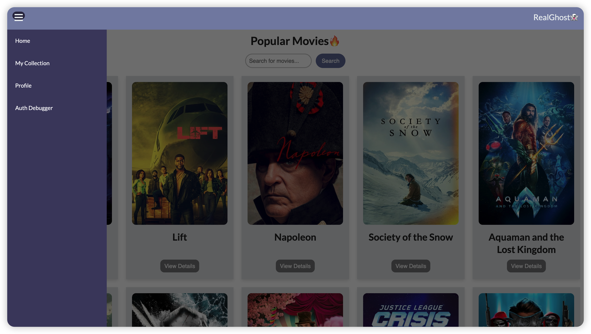
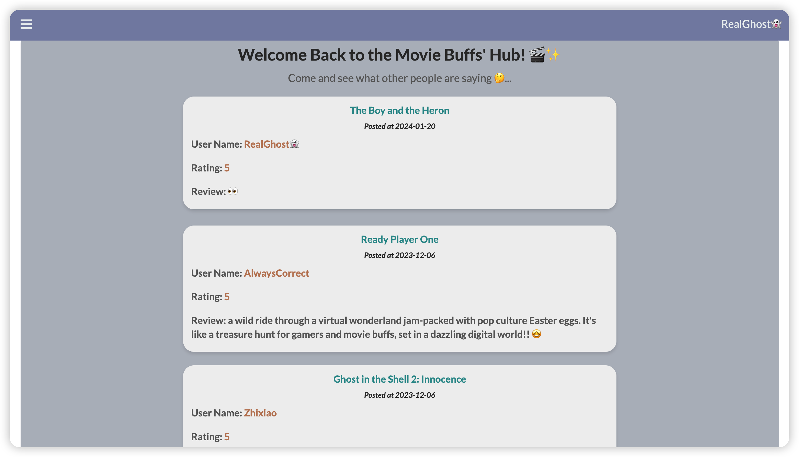
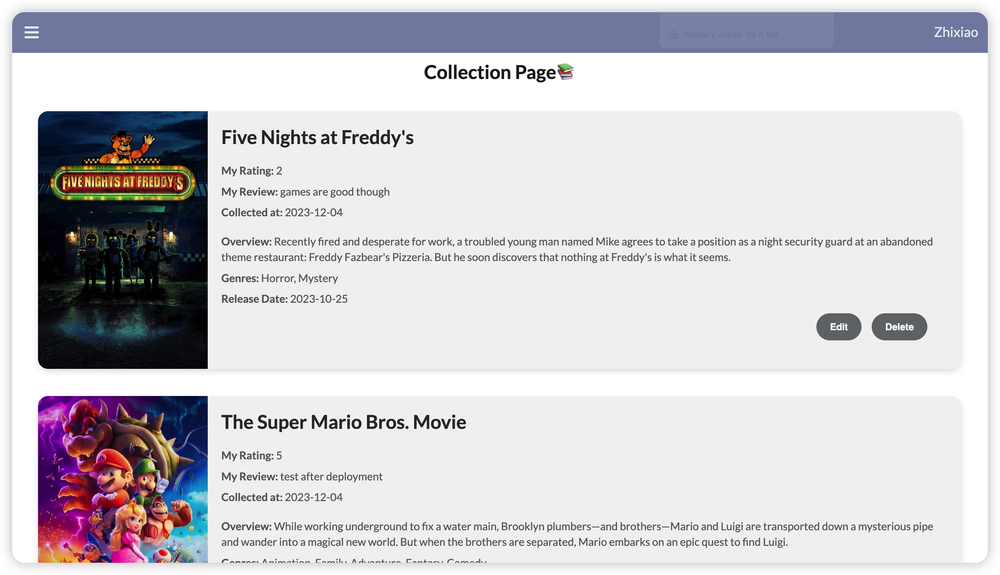
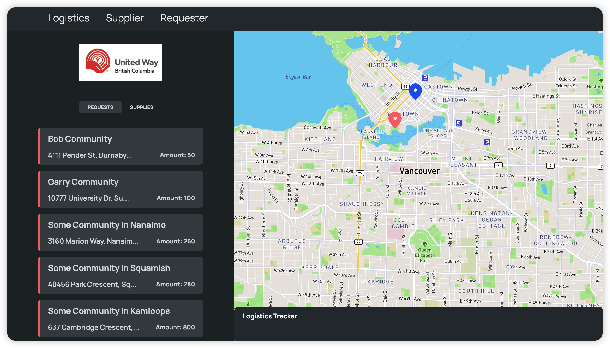
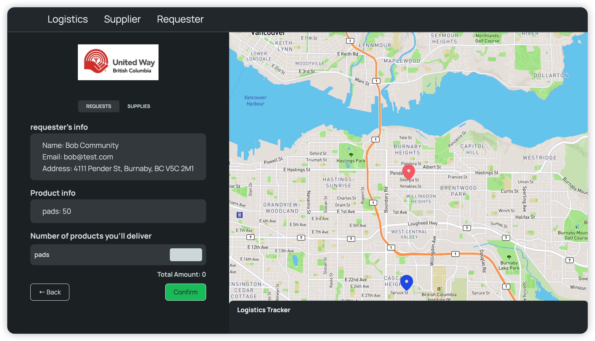
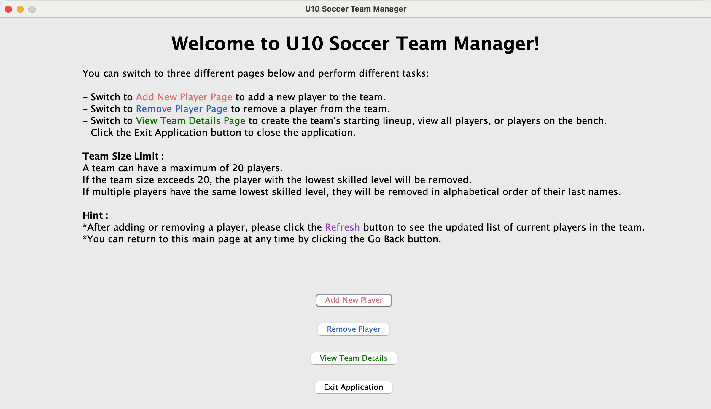

# Portfolio

## Education
- **Northeastern University**, Master of Science in Computer Science, **GPA 4.0/4.0**, *Jan 2023 – Dec 2025*
- **China University of Geosciences**, Bachelor of Accounting, Grade 91.2/100, *Sep 2017 – Jun 2021*
    
  
## SKILLS
- **Programming Languages**: JavaScript, Python, Java, SQL, C, HTML/CSS
- **Graduate-level Courses**: Web Development, Mobile Application Development, Database Management,Object-Oriented Design, Data Structures and Algorithms, Discrete Structures

## Work Experience
**Teaching Assistant | Northeastern University** *Sep 2023 - Present*
- Mentored eleven graduate students in the course ”Intensive Foundations of Computer Science,” specifically guiding the design and development of their final projects. Provided instruction in **Python** and **Streamlit**, with a focus on integrating **external APIs** for creating **web applications**.
- Collaborated closely with a fellow Teaching Assistant and professor to update the **Gradescope Autograder codebase**,
including developing robust **unit test scripts** in **Python**. Maintained code quality and managed project updates by
utilizing **Git**, improving proficiency in **version control** and enhancing **team collaboration**.

## Projects
**[Cine Tracker | Full Stack Web Application | Personal Project](https://cinetracker-v1.vercel.app/)** *Dec 2023*

- Developed and deployed a full-stack web application for movie rating and review. Integrated dynamic user interaction features, allowing every logged-in user to view and interact with posts from others on the HomePage **comment section**, fostering a **community-driven platform**.
- Designed and implemented the front-end using **React.js**, ensuring a responsive and user-friendly interface across devices, from desktop to mobile. Deployed the React-based front-end on **Vercel**.
- Implemented efficient server-side operations using **Node.js** and **Express.js**, and deployed **RESTful web APIs** on **Google Cloud**. 
- Employed **Prisma** as the ORM tool with **MySQL** to store data in a cloud environment (deployed on **PlanetScale**), ensuring real-time data availability and interaction.
- Integrated **Auth0** for secure **user authentication**, providing reliable login and logout functionalities.

**[Flow Link | Full Stack Web Application | Team Project for Hackathon](https://hackathon-team2-demo.vercel.app/home)** *Nov 2023*
- Developed an application featuring an **interactive map** in three days for United Way British Columbia and the Period Promise Campaign, assisting volunteers in distributing and delivering menstrual products, thereby connecting communities, volunteers, and suppliers. 
- Integrated the **Google Map API** to effectively display the locations of individuals/communities needing menstrual products and those donating them.
- Implemented the application’s front-end using **React** and **Vite**, paired with a back-end developed with **Node.js**, **Prisma** and **MySQL**.

**[Soccer Team Manager | Java | Personal Project](https://github.com/Esther2524/soccerTeamManager)** *Aug 2023*
- Developed a **Java** application with an **interactive GUI** using **AWT** and **Swing** frameworks. Applied Object-Oriented Programming (**OOP**) principles for efficient team management, including **ActionListener** for seamless navigation and real-time functionality.
- Facilitated features such as player addition/removal, team details viewing, and automatic starting lineup
generation, following the Model-View-Controller (**MVC**) architectural pattern.

**[Artwork Viewer Python Personal Project](https://github.com/Esther2524/artwork_viewer)** *Apr 2023*
- Created a **Python** application with a **Tkinter-designed three-page** interface for exploring artist and art- work data. Utilized **Regular Expressions** for data cleaning, **Pandas** for data manipulation, and **custom hash method** for merging and deduplication.
- Enabled user-driven data visualization and analysis across **two interaction** levels, generating insights into artwork distributions and trends, such as type, year, and material, based on user-selected criteria using **Matplotlib** for data visualization.
